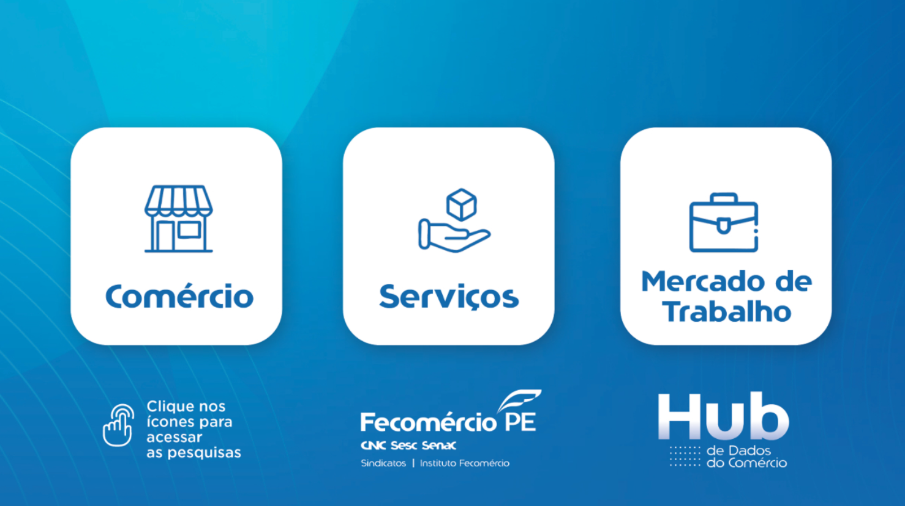
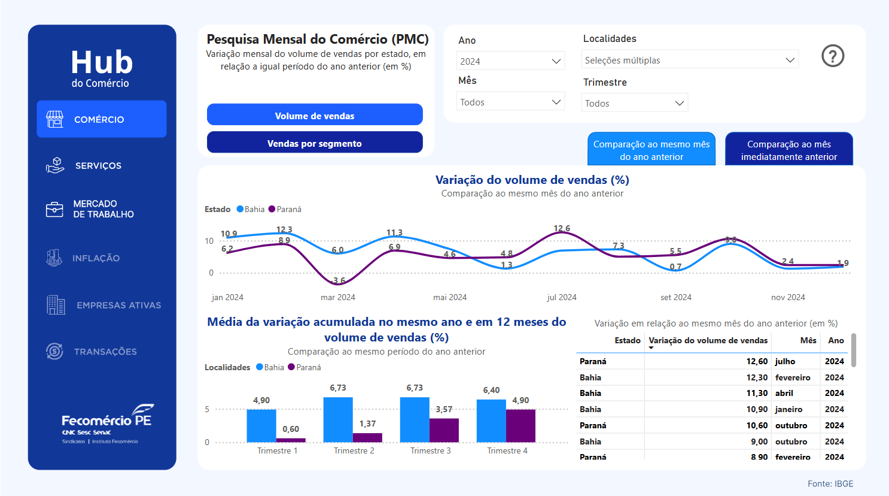

<h1> 📊 PROJETO POWER BI - FECOMERCIO (HUB DE DADOS)</h1>

O Hub de Dados do Comércio representa um marco no apoio ao desenvolvimento econômico de Pernambuco, oferecendo ferramentas de alta performance e dados precisos que potencializam o planejamento estratégico e a tomada de decisões. Como a primeira Fecomércio a implementar e disponibilizar um serviço dessa magnitude, colocamos a inovação no centro das nossas ações, reafirmando o compromisso de impulsionar o crescimento sustentável e fortalecer o empresariado local.

<h2> 🚀 DashBoard </h2>

🔗 Hub de Dados: <a href="https://app.powerbi.com/view?r=eyJrIjoiZDhmMTU4YTItNGFiZS00NjI2LTg4MWYtZDA1ZTlkZjgyY2UwIiwidCI6ImMyZDlkNjk5LWZmZjItNGI5NS04NzQ0LWE4MDAzNjZhYjMxOSJ9&pageName=fe20d46a58ca40daea56" target="_blank">Hub de Dados do Comércio (FeComércio)</a>

🔗 Reportagem: <a href="https://fecomercio-pe.com.br/site/fecomercio-pe-lanca-hub-de-dados-do-comercio-para-impulsionar-o-desenvolvimento-do-setor-em-pernambuco/" target="_blank">Reportagem sobre o Hub de Dados do Comércio (FeComércio)</a>

<h2> 📌 Visualizações do Dashboard </h2>
<h5> 📍 1º Fase do Projeto: Definição e Configuração Inicial </h5>

<h5> 📍 1º Fase do Projeto: Definição e Configuração Inicial  </h5>

<h2>👨‍💻 Professores/Orientadores</h2>
<ul>
    <li>Rafaella Nascimento</li>
    <li>Marco Mialaret</li>
    <li>Camila Dantas</li>
</ul>

<h2>👨‍💻 Alunos e Colaboradores</h2>

<ul>
    <li>Cibelly Santos</li>
    <li>Higor Cabral</li>
    <li>Leonardo Paixão</li>
    <li>Larissa</li>
</ul>

<h5>📌 LinkedIn: <a href="https://www.linkedin.com/in/higor-cabrall/" target="_blank">Higor Cabral</a></h5>

